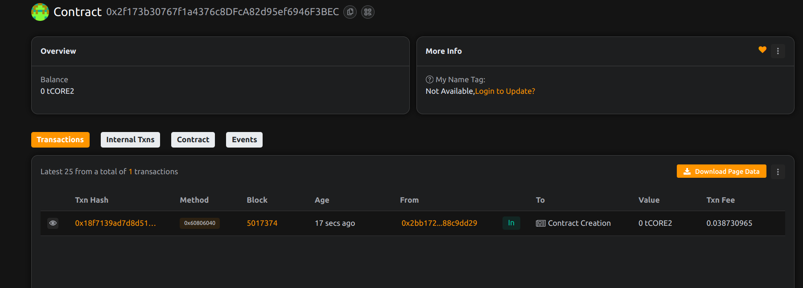

# Project Title: RentMyNFT: Decentralized NFT Leasing Protocol
 
## Project Description

RentMyNFT is a decentralized smart contract protocol that enables users to lease their ERC-721 NFTs for a fixed period in exchange for payment. This opens the door for temporary usage rights, such as for metaverse assets, in-game items, or access tokens.

## Project Vision

To unlock liquidity and utility in idle NFTs by creating a trustless, programmable rental marketplace for NFTs.

## Key Features

- Lease NFTs without needing to trust the renter
- Time-based expiry and automatic return of ownership
- On-chain payment and rental terms enforcement
- Support for any ERC-721 compatible asset

## Future Scope

- Collateralized leasing with slashing mechanisms
- Support for ERC-1155 and ERC-4907 extensions
- Reputation and review system for renters and owners
- Integration with NFT marketplaces and metaverse platforms
- Project done by Riahabh Patel
- 
## Contract Details
0x2f173b30767f1a4376c8DFcA82d95ef6946F3BEC
 project done by Rishabh Patel....  
